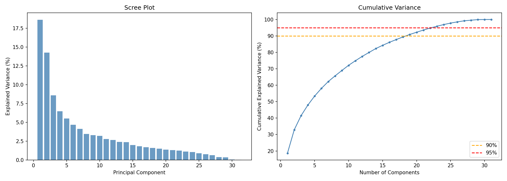
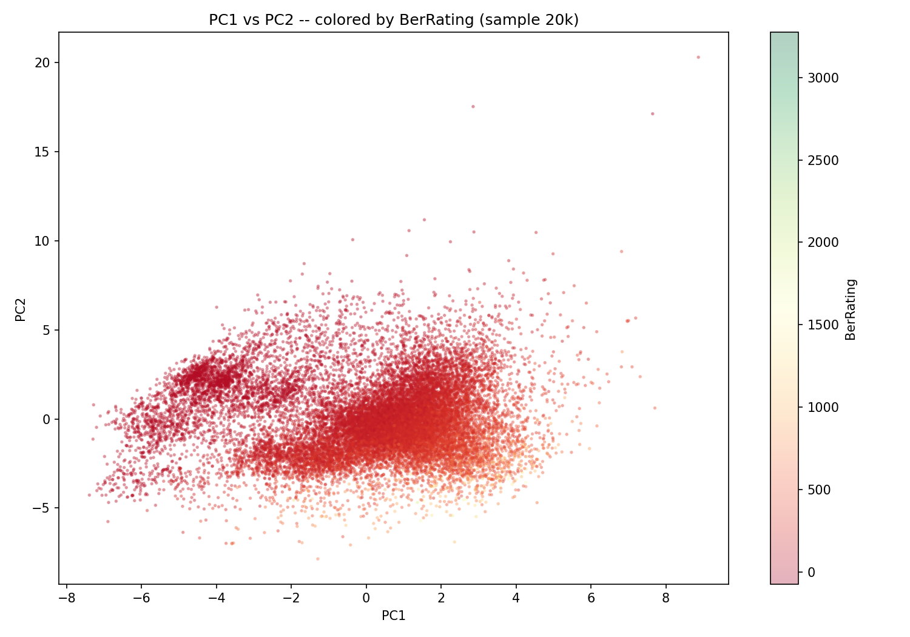
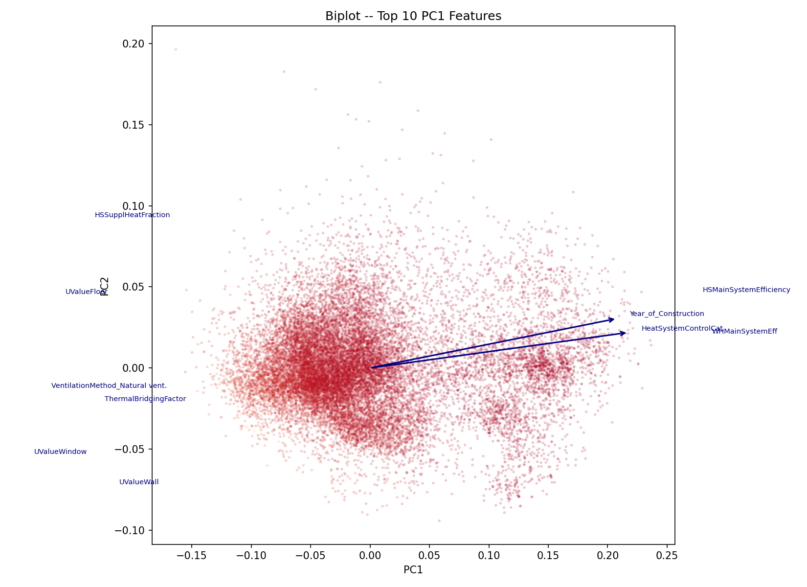
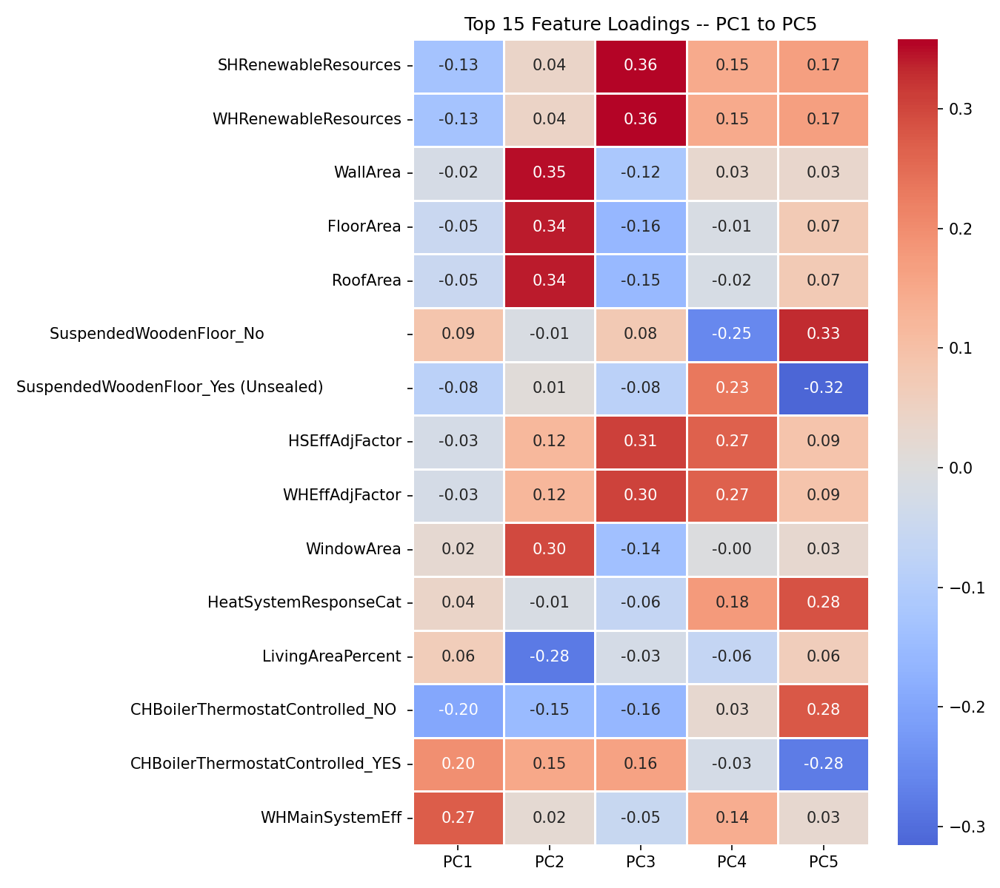
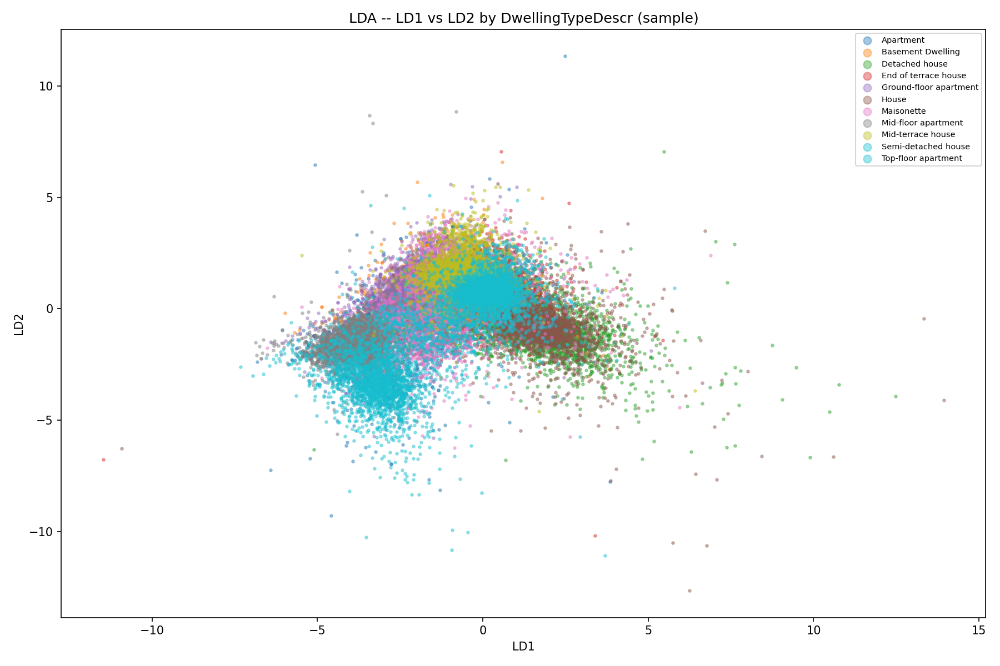
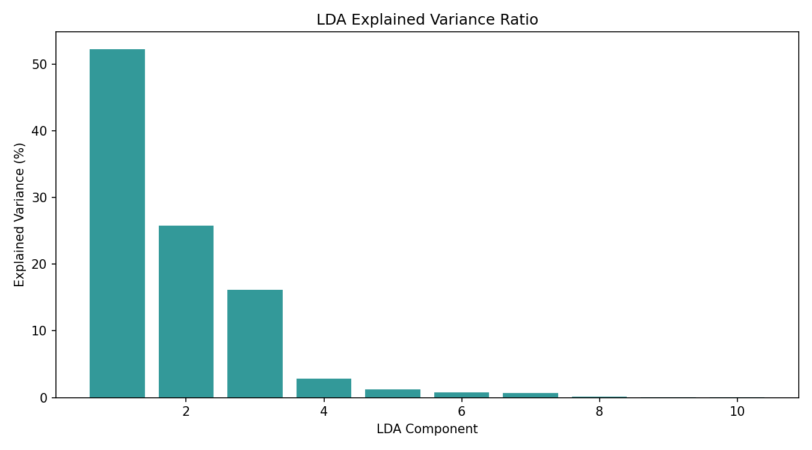

# PCA & FDA/LDA Analysis — `pca_lda_analysis.ipynb`

This document describes the full 6-step dimensionality-reduction analysis pipeline built for the Irish Home BER dataset (`BER_Cleaned_Optimized.parquet`, 1.35M rows, 45 columns, 0 missing values).

---

## Notebook Overview

| Step | Cell(s) | Description |
|------|---------|-------------|
| **1 – Feature Audit** | 2 code cells | Flags near-zero-variance (NZV) categoricals (>95% one value), prints encoding plan (binary / one-hot / drop) |
| **2 – Encoding & Scaling** | 1 code cell | YES/NO → 0/1, multi-class → one-hot, drops `CountyName` / FDA label / NZV cols, StandardScaler |
| **3 – PCA** | 1 code cell | Full PCA → scree plot, cumulative variance table, PC1/PC2 scatter by BerRating, biplot top-10 arrows, heatmap PC1–PC5, PC–BerRating correlations, top-5 features per PC |
| **4 – LDA** | 1 code cell | LDA on `DwellingTypeDescr` → LD1/LD2 scatter, explained variance bar chart, top-5 features per LD |
| **5 – Comparison** | 1 code cell | 5-fold CV with Logistic Regression + Random Forest on Original / PCA-90% / LDA features (100k sub-sample) |
| **6 – Recommendations** | 1 code cell | Prints optimal n_components for 80/90/95%, best reduction method per downstream task |

---

## Encoding Decisions

| Column Group | Strategy | Reason |
|---|---|---|
| `CountyName` | **Dropped** | Geographic identifier — not a building physical feature |
| `DwellingTypeDescr` | **FDA label only** | Used as LDA class label; excluded from PCA feature matrix |
| `WarmAirHeatingSystem`, `UndergroundHeating`, and other NZV cols | **Dropped** | >95% of rows share one value → near-zero variance |
| Binary YES/NO columns | **0 / 1 encoding** | Minimal information loss, avoids dummy explosion |
| `VentilationMethod`, `StructureType`, `ThermalMassCategory`, etc. | **One-hot encoding** | Multi-class with meaningful semantic categories |
| Float columns (near-constant std < 1e-6) | **Dropped** | Carry no discriminative signal |

---

## Plots

### PCA — Scree Plot
*Scree plot + cumulative variance with 90%/95% thresholds*

---

### PCA — PC1 vs PC2 Scatter (colored by BerRating)
*PC1 vs PC2 scatter colored by BerRating (20k sample)*

---

### PCA — Biplot (Top-10 Loading Arrows)
*PC1/PC2 biplot with top-10 feature loading arrows*

---

### PCA — Feature Loadings Heatmap (PC1–PC5)
*Heatmap of top-15 feature loadings across PC1–PC5*

---

### LDA — LD1 vs LD2 Scatter (colored by DwellingTypeDescr)
*LD1 vs LD2 colored by dwelling type class*

---

### LDA — Explained Variance Ratio
*LDA explained variance ratio bar chart*

---

## PCA Variance Thresholds (reference)

| Variance Target | Typical Components (approximate) |
|---|---|
| 80% | ~few components |
| **90%** | **Recommended for downstream BerRating regression** |
| 95% | Maximum recommended before diminishing returns |

---

## Comparison Methodology (Step 5)

- Sub-sampled to **100,000 rows** to keep runtime manageable.
- **5-fold Cross-Validation** on all feature sets.
- Two classifiers compared per feature set:
  - `LogisticRegression` (max_iter=500)
  - `RandomForestClassifier` (100 trees, max_depth=10)
- Feature sets compared:
  1. **Original** (full encoded feature matrix)
  2. **PCA at 90% variance** (reduced component matrix)
  3. **LDA** (class-driven reduced matrix)

---

## Final Recommendations

| Downstream Task | Recommended Approach |
|---|---|
| `BerRating` regression | PCA at 90% variance (fewer features, preserves variance) |
| `DwellingTypeDescr` classification | LDA features (maximises class separation) |
| Non-linear baseline | Random Forest on original features (scale-free, robust) |

> **Note on Step 5 runtime:** The 5-fold CV comparison is the most computationally expensive step. It automatically sub-samples to 100k rows to maintain a reasonable execution time.
