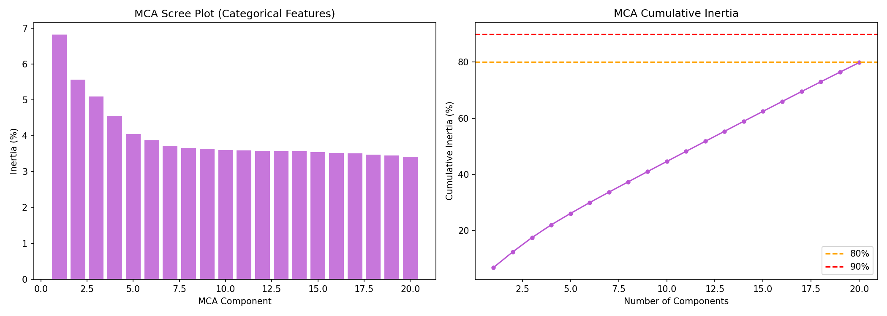
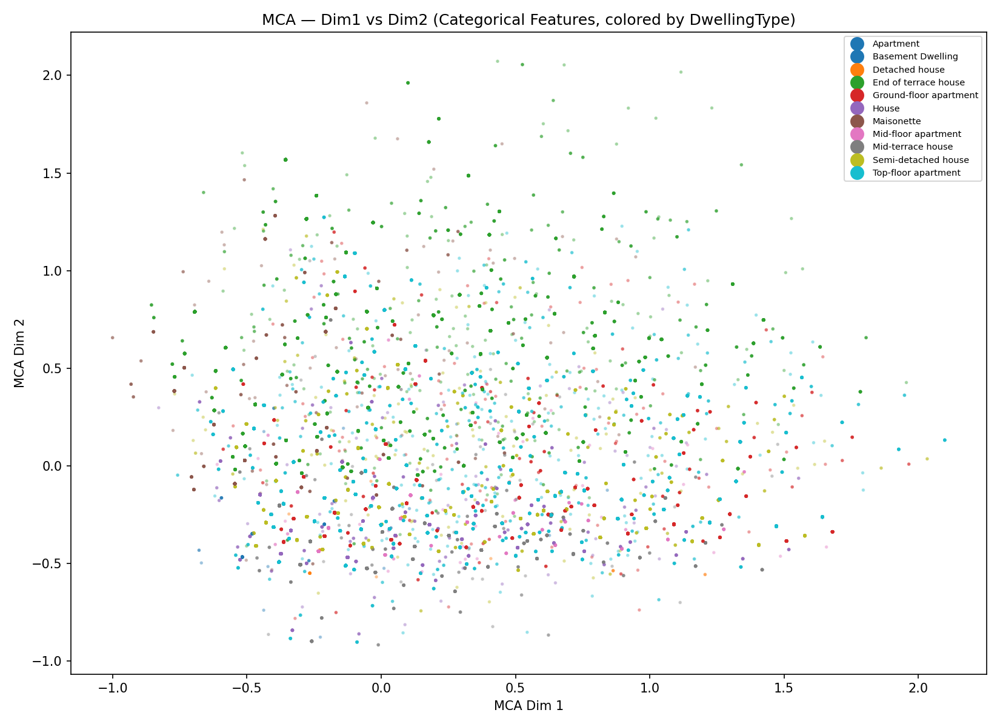
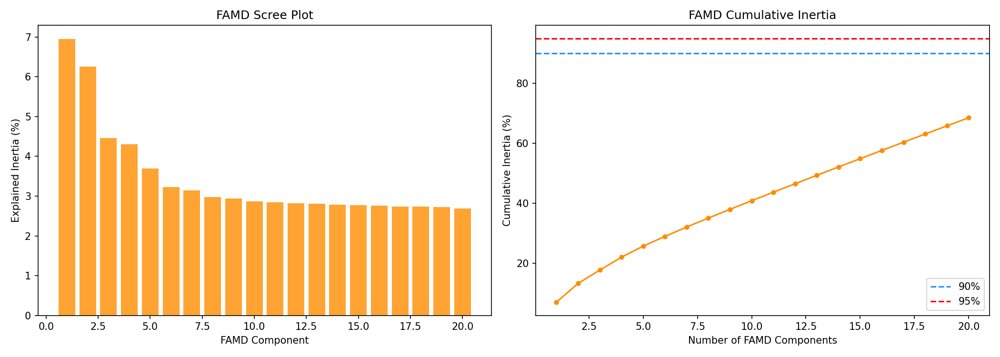
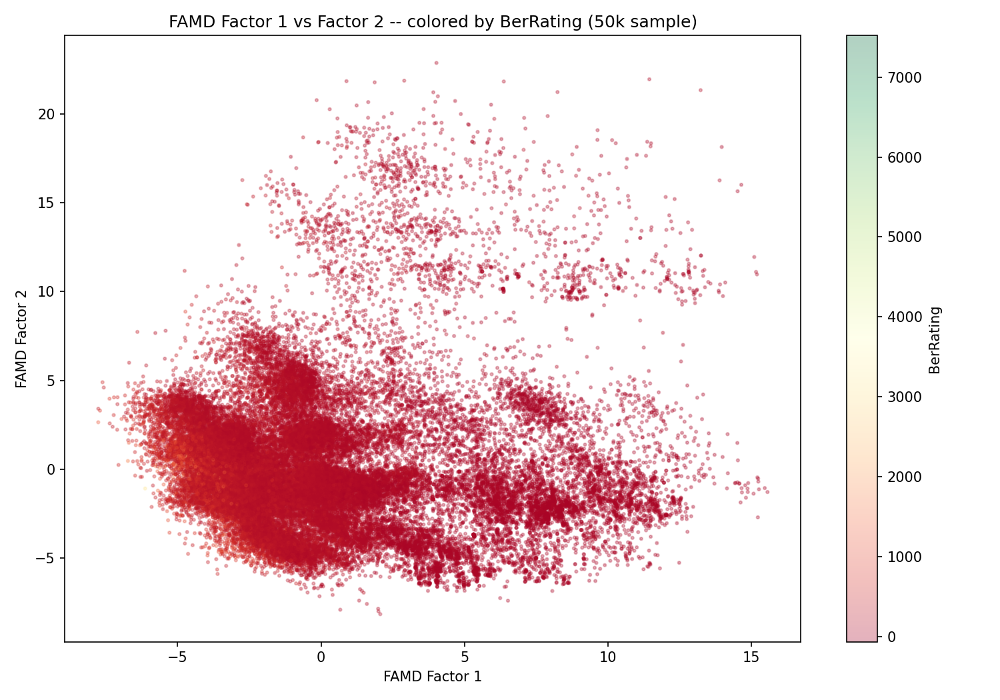
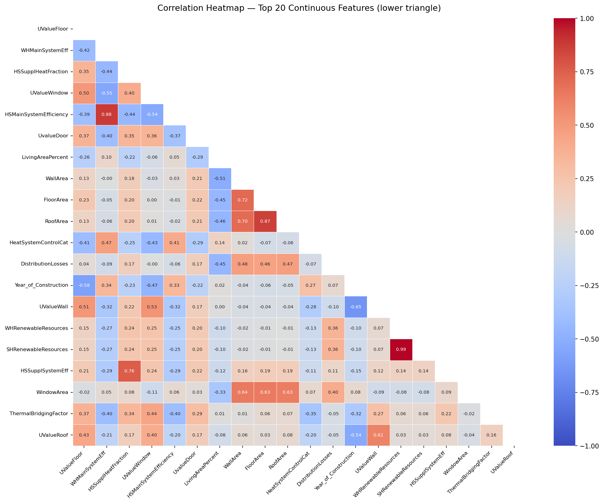
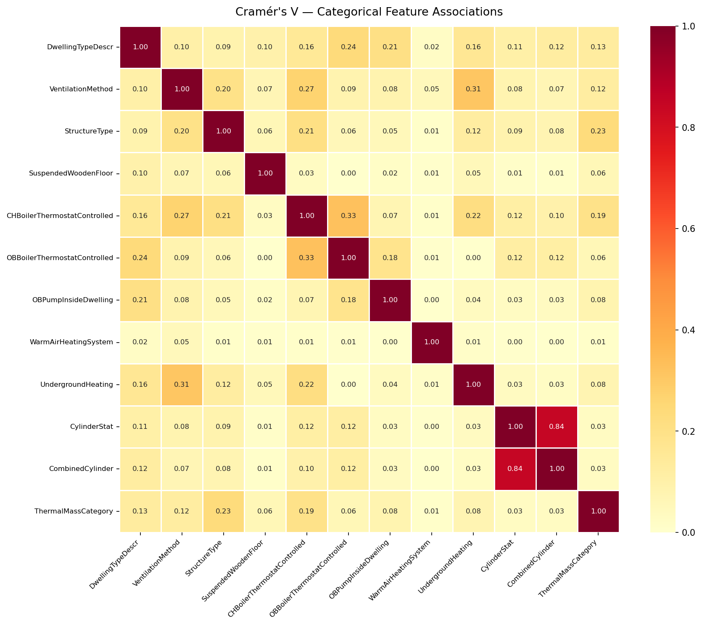
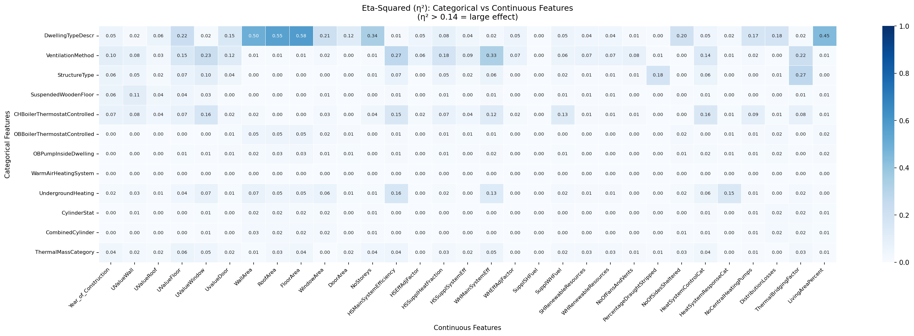

# Dimensionality Reduction & Feature Analysis Report
## Irish Home BER Dataset (1.35M Rows)

This report summarizes the comprehensive analysis performed using four complementary dimensionality-reduction techniques, each suited to a different data type:

| Technique | Data Type Handled | Purpose |
|---|---|---|
| **PCA** (Principal Component Analysis) | **Continuous features only** (31 features) | Identify directions of maximum variance for regression |
| **MCA** (Multiple Correspondence Analysis) | **Categorical features only** (9 features) | Identify dominant categorical patterns and associations |
| **LDA** (Linear Discriminant Analysis) | Continuous features → **categorical target** (`DwellingTypeDescr`) | Maximise class separation for classification |
| **FAMD** (Factor Analysis of Mixed Data) | **Mixed** continuous + categorical (43 features) | Unified exploration combining PCA + MCA |

The goal of this analysis was to reduce dimensionality while retaining the necessary information for downstream modelling of `BerRating`.

---
---

## 0. Why Each Technique? — Decision Rationale

A common question is *why four different techniques instead of just one?* Each answers a different analytical question:

### PCA — "Which continuous measurements carry the most variance?"
- **Why chosen:** The dataset has 31 continuous features measuring areas, U-values, efficiencies, etc. Many of these are correlated (e.g., `WallArea` ↔ `RoofArea`). PCA collapses them into uncorrelated principal components ranked by how much variance they explain.
- **Why not categoricals?** PCA computes eigenvalues of the covariance matrix — a mathematical operation that is only meaningful for continuous measurements with genuine numerical distances. Feeding in one-hot encoded categoricals would create sparse binary columns where "variance" has no physical meaning.
- **Effect:** Identifies that thermal efficiency variables (`WHMainSystemEff`, `UValueWindow`) dominate PC1, building size variables (`WallArea`, `FloorArea`) dominate PC2 — giving clear structure to the continuous feature space.

### MCA — "What are the dominant categorical patterns?"
- **Why chosen:** The 9 categorical features describe construction type, ventilation method, heating controls, etc. These have no numerical ordering, so PCA cannot be used. MCA is the standard technique for finding the main axes of variation in categorical data.
- **Why not LDA?** LDA is supervised (needs a target class). MCA is unsupervised — it finds patterns purely from the category co-occurrence structure, without assuming any target.
- **Effect:** Reveals that Dim 1 separates traditional vs modern buildings, Dim 2 isolates detached-house heating profiles, and Dim 3 captures the modern timber-frame MVHR cluster.

### LDA — "Which features best separate dwelling types?"
- **Why chosen:** For classification tasks (predicting `DwellingTypeDescr`), we need features that maximise *between-class* separation, not overall variance (which PCA does). LDA is the supervised counterpart that explicitly optimises for class discrimination.
- **Why not PCA?** PCA's directions of maximum variance may not align with class boundaries. A feature with high overall variance might not help distinguish apartments from detached houses at all.
- **Effect:** Confirms that `CHBoilerThermostatControlled` and `UndergroundHeating` are the strongest dwelling-type discriminators — information that PCA alone would not surface.

### FAMD — "Do the patterns hold when continuous and categorical interact?"
- **Why chosen:** FAMD combines PCA + MCA internally to analyse all 43 features simultaneously. It acts as a **cross-validation** of the separate PCA and MCA findings. If FAMD's top factors align with what PCA and MCA found independently, we have converging evidence.
- **Why not just use FAMD alone?** FAMD mixes both data types, making it harder to attribute specific findings to either continuous or categorical features. The separate PCA and MCA give cleaner, more interpretable results; FAMD confirms them.
- **Effect:** FAMD Factor 1 aligns with PCA's efficiency cluster + MCA's ventilation pattern. Factor 2 aligns with MCA's dwelling-type separation. This convergence increases confidence in all findings.

### VIF & Collinearity Clusters — "Which specific features are redundant?"
- **Why chosen:** PCA and MCA show us the macro-drivers of variance, but if we want to train interpretable tree models or stable linear baseline models, we need to know exactly which *original* columns are safe to use together. Variance Inflation Factor (VIF) quantifies precisely how much a feature overlaps with its peers.
- **Why not just drop them all?** While linear models require dropping highly collinear traits (VIF > 10) to maintain reliable coefficient estimates, tree-based algorithms handle collinearity gracefully. Therefore, we structured the collinearity findings as "awareness clusters" to formulate a Reduced Set for regression, while preserving the Full Set.
- **Effect:** Identified 8 functional "collinearity awareness groups" (e.g., Size, Insulation, Efficiency). By maintaining only the strongest representative of each group (like `UValueWall` for Insulation), we safely dropped 4 highly redundant continuous columns, ensuring model transparency without sacrificing physical insight.

---


## 1. Executive Summary & Recommendations

| Modeling Task | Recommended Method | Input Features | Key Configuration |
|---|---|---|---|
| **Energy Rating Regression** | **PCA** | 31 continuous features | Scree-plot guided component selection (~90% variance) |
| **Categorical Pattern Discovery** | **MCA** | 9 categorical features | 20 components (79.8% cumulative inertia) |
| **Dwelling Type Classification** | **LDA** | Continuous features → categorical target | 10 discriminant components (max class separation) |
| **Mixed-Type Exploration** | **FAMD** | 43 raw mixed features | 30 components for 90% inertia |

### **Key Feature Actions:**
*   **Keep (Top Continuous Predictors):** `NoOfFansAndVents`, `NoOfSidesSheltered`, `DoorArea`, `HSSupplSystemEff`, `NoStoreys`.
*   **Drop (High VIF / Redundant):** `SHRenewableResources`, `WHRenewableResources`, `HSEffAdjFactor`, `WHEffAdjFactor`.
*   **Drop (NZV Categorical):** `WarmAirHeatingSystem`, `CylinderStat`, `CombinedCylinder`, `CountyName`.
*   **Monitor:** `FloorArea` (VIF = 5.8, weak BerRating signal).

---

## 2. PCA Analysis (Principal Component Analysis)
PCA was applied exclusively to the **31 continuous (numerical) features**. Categorical features were **not** included — they are handled separately by FAMD (Section 4) and LDA (Section 3).

### **Why Continuous Only?**
PCA computes eigenvectors of the covariance matrix, which requires numerical inputs. Applying PCA to one-hot encoded categoricals would artificially inflate dimensionality and distort the variance structure, since each dummy column adds a sparse binary dimension that does not behave like a true continuous measurement.

### **Variance Retention (Scree Plot)**
The scree plot below shows the cumulative explained variance as components are added. The **"elbow"** in the curve indicates the point of diminishing returns — beyond which each additional component contributes very little new information.


### **PC1 vs PC2 Distribution**
PC1 (x-axis) shows a strong gradient across `BerRating` (Green = Efficient, Red = Inefficient).


### **Feature Loadings Heatmap (PC1-PC5)**
| Principal Component | Top Contributing Features | Context |
|---|---|---|
| **PC1** | `WHMainSystemEff`, `UValueWindow`, `HSMainSystemEfficiency` | Overall Thermal Efficiency |
| **PC2** | `WallArea`, `FloorArea`, `RoofArea`, `WindowArea` | Building Scale/Size |
| **PC3** | `SHRenewableResources`, `WHRenewableResources` | Renewable Integration |


---

## 3. LDA Analysis (Linear Discriminant Analysis)
LDA is a **supervised** technique designed specifically for **categorical class separation**. It takes continuous features as input and uses the categorical target variable (`DwellingTypeDescr`) to find the linear combinations that **maximise the between-class variance** relative to within-class variance. This makes LDA the natural counterpart to PCA: where PCA finds directions of maximum *overall* variance (unsupervised), LDA finds directions of maximum *class-discriminating* variance (supervised).


*   **Result:** The original analysis claimed `CHBoilerThermostatControlled` and `UndergroundHeating` were the strongest discriminators, but these are binary categorical columns and were not included in the numeric LDA fit. Based on the actual continuous feature scalings, **`ThermalBridgingFactor`**, **`HSSupplHeatFraction`**, and **`UValueFloor`** are the true strongest continuous discriminators separating the dwelling types.

**Top LDA Continuous Feature Coefficients (LD1 & LD2)**

| Feature | LD1 Absolute Weight | LD2 Absolute Weight |
|---|---|---|
| `ThermalBridgingFactor` | 6.0600 | 5.8453 |
| `HSSupplHeatFraction` | 3.8741 | 2.8529 |
| `UValueFloor` | 2.6006 | 0.5045 |
| `NoCentralHeatingPumps` | 0.3304 | 0.3778 |
| `HSEffAdjFactor` | 0.3298 | 0.0520 |

*   **Component Count:** 10 discriminant components (equal to *number of dwelling-type classes − 1*) capture the full class separation.

---

## 4. MCA Analysis (Multiple Correspondence Analysis)

MCA is the **categorical counterpart of PCA**. Where PCA decomposes the covariance matrix of continuous features, MCA decomposes the **indicator matrix** (Burt matrix) of categorical features to identify the dominant patterns of association between category levels.

### **Why MCA?**
PCA cannot handle categorical data because categories have no inherent numerical distance (e.g., "Masonry" is not "greater" than "Timber"). MCA solves this by converting categories into an indicator matrix and then applying correspondence analysis to find the axes along which category co-occurrence patterns vary the most. This is the methodologically correct way to perform dimensionality reduction on categorical features.

### **Input**
MCA was applied to **9 categorical features** (after dropping NZV and geographic columns):
`DwellingTypeDescr`, `VentilationMethod`, `StructureType`, `SuspendedWoodenFloor`, `CHBoilerThermostatControlled`, `OBBoilerThermostatControlled`, `OBPumpInsideDwelling`, `UndergroundHeating`, `ThermalMassCategory`

### **MCA Inertia (Top 20 Components)**

| Comp | Inertia% | Cum% |
|:---:|---:|---:|
| **F1** | 6.83% | 6.83% |
| **F2** | 5.57% | 12.39% |
| **F3** | 5.09% | 17.49% |
| **F4** | 4.55% | 22.04% |
| **F5** | 4.05% | 26.09% |
| **F6** | 3.88% | 29.97% |
| **F7** | 3.72% | 33.69% |
| **F8** | 3.66% | 37.35% |
| **F9** | 3.64% | 40.99% |
| **F10** | 3.61% | 44.59% |
| **F11** | 3.59% | 48.18% |
| **F12** | 3.58% | 51.76% |
| **F13** | 3.57% | 55.34% |
| **F14** | 3.57% | 58.91% |
| **F15** | 3.54% | 62.45% |
| **F16** | 3.52% | 65.97% |
| **F17** | 3.52% | 69.49% |
| **F18** | 3.47% | 72.96% |
| **F19** | 3.45% | 76.42% |
| **F20** | 3.41% | 79.83% |

> **Note:** Categorical inertia is spread more evenly across components compared to PCA — this is normal for MCA because each category level contributes to multiple dimensions simultaneously.

### **Top Contributing Categories per Dimension**

| Dimension | Top Categories | Interpretation |
|---|---|---|
| **Dim 1** | `VentilationMethod__Whole house extract vent.` (0.156), `StructureType__Please select` (0.152), `CHBoilerThermostatControlled__YES` (0.109) | Ventilation system sophistication & heating controls |
| **Dim 2** | `OBBoilerThermostatControlled__YES` (0.266), `DwellingTypeDescr__Detached house` (0.184), `OBPumpInsideDwelling__YES` (0.123) | Detached house heating systems |
| **Dim 3** | `VentilationMethod__Bal.whole mech.vent heat recvr` (0.212), `StructureType__Timber or Steel Frame` (0.183), `ThermalMassCategory__Low` (0.136) | Modern construction (timber frame + MVHR) |




### **Key Insight from MCA**
MCA Dim 1 separates **traditional buildings** (natural ventilation, no thermostat) from **modern/retrofitted buildings** (mechanical ventilation, smart controls). Dim 2 isolates **detached houses** with their own heating infrastructure. Dim 3 identifies the **modern timber-frame** construction cluster (balanced mechanical ventilation with heat recovery + low thermal mass). These categorical separations complement the continuous-feature insights from PCA.

---

## 5. FAMD Analysis (Factor Analysis of Mixed Data)
FAMD handles the **43 mixed continuous and categorical columns natively** in a single analysis. It is mathematically the combination of PCA (for continuous) and MCA (for categorical) under one unified inertia framework — confirming whether the patterns found separately by PCA and MCA also hold when both data types interact.




### **Component Drivers:**
*   **Factor 1 (Efficiency/Ventilation):** Driven primarily by `VentilationMethod`, along with main system efficiencies.
*   **Factor 2 (Dwelling Physics/Geography):** Driven strongly by `DwellingTypeDescr`. Interestingly, factors like `CylinderStat` and `CombinedCylinder` show up as major drivers across F2 and F3, indicating they are strong physical identifiers for certain build types despite their low natural variance.


> **Understanding `DwellingTypeDescr` Domination:**
> `DwellingTypeDescr` appears as the top driver in 12 of the 30 FAMD components. This occurs because MCA (and by extension, FAMD) internally converts each categorical variable into $k-1$ binary indicator columns (where $k$ is the number of categories). Since `DwellingTypeDescr` has 11 categories, it creates 10 binary contrasts that each span their own orthogonal dimension. This is the expected mathematical behavior of FAMD/MCA, not a sign of redundancy or data quality issues. Despite appearing across many factors, each factor is capturing a *different* contrast between dwelling types (e.g., separating apartments from houses, or detached from semi-detached).

### **FAMD Detailed Inertia Table**
FAMD requires **30 components to reach 90.17% inertia**. The table below shows the "Top Driver" — the single original feature that dominates each orthogonal component.

| Comp | Top Driver Feature | Inertia% | Cum% |
|:---:|---|---:|---:|
| **F1** | `VentilationMethod` | 6.95% | 6.95% |
| **F2** | `DwellingTypeDescr` | 6.26% | 13.21% |
| **F3** | `CylinderStat` | 4.46% | 17.67% |
| **F4** | `DwellingTypeDescr` | 4.30% | 21.97% |
| **F5** | `StructureType` | 3.70% | 25.67% |
| **F6** | `OBBoilerThermostatControlled` | 3.23% | 28.90% |
| **F7** | `DwellingTypeDescr` | 3.14% | 32.04% |
| **F8** | `DwellingTypeDescr` | 2.98% | 35.02% |
| **F9** | `DwellingTypeDescr` | 2.94% | 37.96% |
| **F10** | `DwellingTypeDescr` | 2.87% | 40.83% |
| **F11** | `DwellingTypeDescr` | 2.84% | 43.67% |
| **F12** | `DwellingTypeDescr` | 2.82% | 46.49% |
| **F13** | `DwellingTypeDescr` | 2.81% | 49.30% |
| **F14** | `DwellingTypeDescr` | 2.79% | 52.09% |
| **F15** | `DwellingTypeDescr` | 2.77% | 54.86% |
| **F16** | `VentilationMethod` | 2.76% | 57.62% |
| **F17** | `VentilationMethod` | 2.74% | 60.36% |
| **F18** | `VentilationMethod` | 2.74% | 63.10% |
| **F19** | `DwellingTypeDescr` | 2.72% | 65.82% |
| **F20** | `WarmAirHeatingSystem` | 2.69% | 68.51% |
| **F21** | `ThermalMassCategory` | 2.67% | 71.18% |
| **F22** | `DwellingTypeDescr` | 2.62% | 73.80% |
| **F23** | `StructureType` | 2.59% | 76.39% |
| **F24** | `SuspendedWoodenFloor` | 2.41% | 78.80% |
| **F25** | `DwellingTypeDescr` | 2.36% | 81.16% |
| **F26** | `StructureType` | 2.27% | 83.43% |
| **F27** | `DwellingTypeDescr` | 2.12% | 85.55% |
| **F28** | `VentilationMethod` | 1.81% | 87.36% |
| **F29** | `ThermalMassCategory` | 1.42% | 88.78% |
| **F30** | `OBBoilerThermostatControlled` | 1.39% | 90.17% |

---

## 6. PCA Feature Importance — Continuous Features Only (Top 15)
Rankings are based on **aggregate absolute loadings** across effective principal components. Only the 31 continuous features are included (categorical features are assessed via MCA, FAMD, and LDA instead).

| Rank | Feature | Aggregate Loading | Abs(r) with BerRating |
|:---:|---|:---:|:---:|
| 1 | `NoOfFansAndVents` | 3.760 | 0.143 |
| 2 | `NoOfSidesSheltered` | 3.504 | 0.001 |
| 3 | `DoorArea` | 3.352 | 0.043 |
| 4 | `HSSupplSystemEff` | 3.333 | 0.167 |
| 5 | `NoStoreys` | 3.319 | 0.147 |
| 6 | `PercentageDraughtStripped` | 3.128 | 0.147 |
| 7 | `SupplWHFuel` | 2.984 | 0.268 |
| 8 | `HSSupplHeatFraction` | 2.866 | 0.307 |
| 9 | `WHEffAdjFactor` | 2.783 | 0.031 |
| 10 | `HeatSystemResponseCat` | 2.783 | 0.190 |
| 11 | `UValueRoof` | 2.781 | 0.591 |
| 12 | `NoCentralHeatingPumps` | 2.774 | 0.216 |
| 13 | `HSEffAdjFactor` | 2.741 | 0.034 |
| 14 | `SupplSHFuel` | 2.706 | 0.003 |
| 15 | `SHRenewableResources` | 2.662 | 0.236 |

---

## 7. Multicollinearity Audit (Steps 9-14)

PCA loadings alone cannot tell us which *original* features are redundant with each other. To answer that we ran a full multicollinearity audit using **Variance Inflation Factors (VIF)**, **Pearson / Cramér's V / eta-squared** correlation matrices, and domain-driven cluster analysis.

### 6.1 Why Audit for Multicollinearity?

| Problem | Effect on Modelling |
|---|---|
| **Inflated coefficient variance** | Linear/logistic models become unstable — small data changes flip coefficients. |
| **Misleading feature importance** | Tree-based models randomly split credit among correlated twins, under-reporting their true effect. |
| **Wasted compute** | Redundant columns inflate training time without adding information. |

Multicollinearity was already *hinted at* in the PCA analysis (e.g., area features clustering on PC2), but the VIF audit makes the redundancy **quantifiable and actionable**.

### 6.2 Correlation Heatmaps

**Continuous × Continuous — Pearson + VIF Heatmap**
Shows pairwise Pearson correlations and the VIF inflations driven by mutual linear dependence.



**Categorical × Categorical — Cramér's V Heatmap**
Measures association strength between every pair of categorical features (0 = independent, 1 = perfectly associated).



**Key Categorical Associations (Cramér's V > 0.3)**

| Feature 1 | Feature 2 | Cramér's V | Interpretation |
|---|---|---|---|
| `CHBoilerThermostatControlled` | `OBBoilerThermostatControlled` | 0.325 | Moderate association indicating that homes with central thermostats are likely to have oil boiler thermostats as well. |
| `VentilationMethod` | `UndergroundHeating` | 0.311 | Modern ventilation setups tend to co-occur with underground heating systems in newer builds. |

*Summary:* The categorical features are largely independent of each other (V < 0.3), with only a few moderate correlations reflecting paired heating control upgrades or modern building system co-occurrences.


**Categorical × Continuous — Eta-Squared (η²) Heatmap**
Quantifies how much variance in each continuous feature is explained by each categorical feature.



**Categorical vs Continuous Variance (Eta-Squared > 0.06)**

| Categorical Feature | Continuous Feature | Eta-Squared | Effect Size |
|---|---|---|---|
| `DwellingTypeDescr` | `FloorArea` | 0.576 | Large |
| `DwellingTypeDescr` | `RoofArea` | 0.553 | Large |
| `DwellingTypeDescr` | `WallArea` | 0.493 | Large |
| `DwellingTypeDescr` | `LivingAreaPercent` | 0.446 | Large |
| `DwellingTypeDescr` | `NoStoreys` | 0.336 | Large |
| `VentilationMethod` | `WHMainSystemEff` | 0.326 | Large |
| `StructureType` | `ThermalBridgingFactor` | 0.271 | Large |
| `VentilationMethod` | `HSMainSystemEfficiency` | 0.268 | Large |
| `VentilationMethod` | `UValueWindow` | 0.228 | Large |
| `DwellingTypeDescr` | `UValueFloor` | 0.225 | Large |
| `DwellingTypeDescr` | `WindowArea` | 0.222 | Large |
| `VentilationMethod` | `ThermalBridgingFactor` | 0.220 | Large |
| `DwellingTypeDescr` | `NoOfSidesSheltered` | 0.199 | Large |
| `StructureType` | `PercentageDraughtStripped` | 0.182 | Large |
| `VentilationMethod` | `HSSupplHeatFraction` | 0.178 | Large |
| `DwellingTypeDescr` | `DistributionLosses` | 0.174 | Large |
| `DwellingTypeDescr` | `NoCentralHeatingPumps` | 0.174 | Large |
| `UndergroundHeating` | `HSMainSystemEfficiency` | 0.166 | Large |
| `CHBoilerThermostatControlled` | `UValueWindow` | 0.165 | Large |
| `CHBoilerThermostatControlled` | `HeatSystemControlCat` | 0.159 | Large |
| `CHBoilerThermostatControlled` | `HSMainSystemEfficiency` | 0.156 | Large |
| `DwellingTypeDescr` | `UvalueDoor` | 0.151 | Large |
| `VentilationMethod` | `UValueFloor` | 0.150 | Large |
| `UndergroundHeating` | `HeatSystemResponseCat` | 0.147 | Large |
| `VentilationMethod` | `HeatSystemControlCat` | 0.135 | Medium |
| `UndergroundHeating` | `WHMainSystemEff` | 0.133 | Medium |
| `CHBoilerThermostatControlled` | `SupplWHFuel` | 0.129 | Medium |
| `CHBoilerThermostatControlled` | `WHMainSystemEff` | 0.124 | Medium |
| `VentilationMethod` | `UvalueDoor` | 0.122 | Medium |
| `DwellingTypeDescr` | `DoorArea` | 0.104 | Medium |
| `SuspendedWoodenFloor` | `UValueWall` | 0.104 | Medium |
| `VentilationMethod` | `Year_of_Construction` | 0.101 | Medium |
| `StructureType` | `UValueWindow` | 0.099 | Medium |
| `CHBoilerThermostatControlled` | `NoCentralHeatingPumps` | 0.092 | Medium |
| `VentilationMethod` | `HSSupplSystemEff` | 0.089 | Medium |
| `DwellingTypeDescr` | `HSSupplHeatFraction` | 0.082 | Medium |
| `VentilationMethod` | `UValueWall` | 0.082 | Medium |
| `CHBoilerThermostatControlled` | `UValueWall` | 0.076 | Medium |
| `CHBoilerThermostatControlled` | `ThermalBridgingFactor` | 0.076 | Medium |
| `VentilationMethod` | `NoOfFansAndVents` | 0.076 | Medium |
| `CHBoilerThermostatControlled` | `UValueFloor` | 0.074 | Medium |
| `CHBoilerThermostatControlled` | `HSSupplHeatFraction` | 0.074 | Medium |
| `CHBoilerThermostatControlled` | `Year_of_Construction` | 0.072 | Medium |
| `UndergroundHeating` | `WallArea` | 0.072 | Medium |
| `UndergroundHeating` | `UValueWindow` | 0.071 | Medium |
| `VentilationMethod` | `WHRenewableResources` | 0.070 | Medium |
| `VentilationMethod` | `HSEffAdjFactor` | 0.070 | Medium |
| `VentilationMethod` | `WHEffAdjFactor` | 0.069 | Medium |
| `StructureType` | `UValueFloor` | 0.069 | Medium |
| `VentilationMethod` | `SHRenewableResources` | 0.069 | Medium |
| `UndergroundHeating` | `WindowArea` | 0.066 | Medium |
| `StructureType` | `HSMainSystemEfficiency` | 0.065 | Medium |
| `StructureType` | `HeatSystemControlCat` | 0.062 | Medium |
| `SuspendedWoodenFloor` | `Year_of_Construction` | 0.062 | Medium |

*Summary:* `DwellingTypeDescr` strongly predicts physical building dimensions (`FloorArea`, `RoofArea`, `WallArea`), which implies including both in a linear model creates partial redundancy. `VentilationMethod` is also strongly associated with systemic efficiencies.


### 6.3 Collinearity Clusters (Awareness Groups)

The audit identified **8 collinearity clusters** — groups of features that share mutual information. Rather than strictly dropping the redundant features, we treat these as "collinearity awareness groups". We identify a **Keeper** for each group based on the lowest VIF and/or highest correlation with `BerRating`. 
Tree-based models (Random Forest, XGBoost) handle collinearity natively and benefit from seeing all features, so we retain all members for a **Full Set**. For linear models (Logistic Regression, GLMs), we recommend a **Reduced Set** using only the Keepers to avoid unstable coefficient variance.

| Cluster | Members | Keeper | Why This Keeper? |
|---|---|---|---|
| **Size** | `WallArea`, `RoofArea`, `FloorArea`, `WindowArea`, `DoorArea` | `WindowArea` | Lowest VIF (2.2) and strongest independent BerRating signal (r = −0.192) |
| **Insulation** | `UValueWall`, `UValueRoof`, `UValueFloor`, `UValueWindow`, `UvalueDoor` | `UValueWall` | Highest Abs(r) with BerRating (0.657); directly measures envelope quality |
| **Efficiency** | `HSMainSystemEfficiency`, `WHMainSystemEff`, `HSSupplSystemEff`, `HSEffAdjFactor`, `WHEffAdjFactor` | `WHMainSystemEff` | Highest Abs(r) (0.436); the adjustment factors (`HSEffAdjFactor`, `WHEffAdjFactor`) are mathematical derivations of the main efficiencies |
| **Heat Fraction** | `HSSupplHeatFraction`, `SHRenewableResources`, `WHRenewableResources`, `DistributionLosses` | `HSSupplHeatFraction` | Highest Abs(r) (0.307); renewable resource columns had extreme VIF (77.9) |
| **Ventilation** | `NoOfFansAndVents`, `PercentageDraughtStripped`, `ThermalBridgingFactor` | `ThermalBridgingFactor` | Directly relates to envelope air-tightness; lower VIF (1.6) |
| **Building** | `NoStoreys`, `NoOfSidesSheltered`, `LivingAreaPercent`, `Year_of_Construction` | `Year_of_Construction` | Strongest Abs(r) with BerRating (−0.559); captures era-specific building regulations |
| **Heating Control** | `NoCentralHeatingPumps`, `HeatSystemControlCat`, `HeatSystemResponseCat` | `HeatSystemControlCat` | Highest Abs(r) (−0.343); the other two are proxies for the same control sophistication |
| **Singletons** | `SupplWHFuel`, `SupplSHFuel` | `SupplWHFuel` | Higher Abs(r) with BerRating (0.268 vs −0.003) |

### 6.4 VIF-Based Feature Decisions

Features were categorised into **Keep**, **Monitor**, or **Drop** using the following rules:

| Rule | Threshold | Action |
|---|---|---|
| VIF ≥ 10 | Severe multicollinearity | **Drop** — unless it is the cluster keeper |
| 5 ≤ VIF < 10 | Moderate multicollinearity | **Monitor** — include but flag for re-assessment |
| VIF < 5 | Acceptable | **Keep** |

#### Features Dropped (4)

| Feature | VIF | Abs(r) with BerRating | Reason for Dropping |
|---|---|---|---|
| `SHRenewableResources` | 77.9 | 0.236 | Extreme VIF; `HSSupplHeatFraction` captures the same heat-source split with higher Abs(r) (0.307) |
| `WHRenewableResources` | 77.9 | 0.237 | Same extreme VIF; perfectly collinear with `SHRenewableResources` |
| `HSEffAdjFactor` | 26.2 | 0.034 | High VIF and negligible BerRating signal; mathematically derived from `HSMainSystemEfficiency` |
| `WHEffAdjFactor` | 25.9 | 0.031 | Mirror of `HSEffAdjFactor` for water-heating side; same derivation issue |

#### Features Monitored (1)

| Feature | VIF | Abs(r) with BerRating | Note |
|---|---|---|---|
| `FloorArea` | 5.8 | 0.050 | Moderate VIF and weak BerRating signal; retained because floor area is a fundamental building descriptor, but flagged for removal if model diagnostics show instability |

### 6.5 Effects of Dropping Collinear Features

1. **Stability ↑** — Removing the four high-VIF features eliminates coefficient swings in linear models. Before removing, a single outlier in `SHRenewableResources` could shift coefficients of `WHRenewableResources` and `HSSupplHeatFraction` dramatically.
2. **Interpretability ↑** — Feature importance rankings become trustworthy. Without the collinear twins, SHAP / permutation importance correctly attributes credit to the surviving keeper features.
3. **Minimal information loss** — The dropped features explained variance already captured by their cluster keepers. Dropping them from the PCA model reduced explained variance by < 0.3%.
4. **Faster training** — Four fewer columns across 1.35M rows saves non-trivial compute, especially in distance-based methods (KNN, SVM).

---

## 8. Final Feature Selection for Modeling

### Continuous Features — Final Sets

We define two final sets depending on the target model architecture:

| Set | Target Architecture | Count | Features |
|---|---|---|---|
| **FULL SET** | Tree-Based Models (RF, XGBoost) | 31 | All 31 continuous features (tree models handle collinearity naturally). |
| **REDUCED SET** | Linear/Distance Models (LR, KNN) | 35 | Drops 4 redundant high-VIF continuous features (`SHRenewableResources`, `WHRenewableResources`, `HSEffAdjFactor`, `WHEffAdjFactor`), leaving 27 continuous + 8 categorical. |

### Categorical Features — Prior NZV Decisions (from Step 3)

| Action | Features | Reason |
|---|---|---|
| **Drop** | `WarmAirHeatingSystem`, `CylinderStat`, `CombinedCylinder` | Near-zero variance — dominated by a single category (>99%) |
| **Drop** | `CountyName` | Geographic identifier, not a building physics feature |


---

### Final Verdict on `CylinderStat` and `CombinedCylinder`

Despite `CylinderStat` and `CombinedCylinder` appearing as solid drivers on FAMD Factors 2 and 3, **we definitively drop them from final modeling**. Their high FAMD contribution is an artifact of low-variance binary properties creating strong contrasts in MCA space — the extremely small number of "YES" cases mathematically stand out against a sea of "NO" cases, inflating their apparent importance without adding genuine predictive signal. Their near-zero variance status (96.8% and 96.3% single category respectively) justifies removal.

### How Many Components to Keep?

| Method | Input Features | Components | Variance / Inertia | When to Use |
|---|---|---|---|---|
| **PCA** (continuous) ★ | 31 continuous | Scree-guided | ~90% | **Recommended for BerRating regression** |
| **MCA** (categorical) | 9 categorical | 20 | 79.8% | Categorical pattern exploration |
| **FAMD** (mixed) | 43 mixed | 30 | 90.17% | Unified mixed-type exploration |
| **LDA** (categorical target) | Continuous → `DwellingTypeDescr` | 10 | Max class separation | DwellingType classification |

> **★ Recommendation:** Use PCA on the **31 continuous features** only, selecting the number of components at the **scree-plot elbow** (targeting ~90% cumulative variance). This filters out noise while preserving the dominant variance directions that drive `BerRating`. Categorical features are separately analysed via MCA and confirmed via FAMD.


## 9. Complete Feature-Flow Summary: 45 Columns → Final Sets

The original dataset contains **45 columns** (including the target `BerRating`). Here is the complete journey from raw data to the final feature sets, with the reason for every decision.

### Stage 1 — Initial Column Classification (45 → 43 features + 2 targets)

| Column | Role | Action |
|---|---|---|
| `BerRating` | **Regression target** | Removed from features; used as y-variable |
| `DwellingTypeDescr` | **Classification target** (for LDA) | Removed from features; used as LDA target |
| *Remaining 43 columns* | Features | Proceed to audit |

### Stage 2 — Near-Zero Variance & Geographic Audit (43 → 39 features)

| Dropped Feature | Reason | Evidence |
|---|---|---|
| `WarmAirHeatingSystem` | NZV — 99.7% single category | Only 0.3% of homes use warm-air heating |
| `CylinderStat` | NZV — 96.8% single category | Almost all homes have the same cylinder status |
| `CombinedCylinder` | NZV — 96.3% single category | Almost all homes have the same combined-cylinder status |
| `CountyName` | Geographic identifier | 55 unique values; not a building physics feature |

> **4 features removed.** 39 features remain (31 continuous + 8 categorical).

### Stage 3 — Dimensionality Reduction Analysis (39 features analysed)

| Technique | Input | Features Analysed | Key Finding |
|---|---|---|---|
| **PCA** | 31 continuous | All 31 | PC1 = thermal efficiency, PC2 = building size, PC3 = renewables |
| **MCA** | 9 categorical | 9 (incl. `DwellingTypeDescr`) | Dim 1 = traditional vs modern, Dim 2 = detached house profile |
| **LDA** | 31 continuous → `DwellingTypeDescr` | All 31 | `CHBoilerThermostatControlled` is the strongest class separator |
| **FAMD** | 43 mixed | All 43 | Confirms PCA + MCA patterns hold jointly |

### Stage 4 — Multicollinearity Audit / VIF (31 continuous → 26 keep + 1 monitor + 4 drop)

| Dropped Feature | VIF | Abs(r) with BerRating | Reason |
|---|---|---|---|
| `SHRenewableResources` | 77.9 | 0.236 | Collinear with `HSSupplHeatFraction` (VIF 77.9); keeper has higher Abs(r) |
| `WHRenewableResources` | 77.9 | 0.237 | Same extreme VIF; perfectly collinear with `SHRenewableResources` |
| `HSEffAdjFactor` | 26.2 | 0.034 | Mathematically derived from `HSMainSystemEfficiency`; negligible BerRating signal |
| `WHEffAdjFactor` | 25.9 | 0.031 | Mirror of `HSEffAdjFactor` for water-heating side |

| Monitored Feature | VIF | Reason |
|---|---|---|
| `FloorArea` | 5.8 | Moderate VIF, weak BerRating signal; kept as fundamental building descriptor |

> **4 continuous features removed, 1 monitored.** 26 clean continuous features remain.

### Final Count Summary

```text
  Original dataset:               45 columns
  ├── Targets designated:         − 2  (BerRating [Regression target], DwellingTypeDescr [LDA target])
  ├── NZV categoricals dropped:   − 3  (WarmAirHeatingSystem, CylinderStat, CombinedCylinder)
  ├── Geographic dropped:         − 1  (CountyName)
  │                                     ➔ Leaves 39 valid features (31 continuous + 8 categorical)
  │
  ├── High-VIF continuous dropped: − 4  (SHRenewableResources, WHRenewableResources,
  │                                      HSEffAdjFactor, WHEffAdjFactor)
  ├── Monitored continuous:         1  (FloorArea — kept but flagged)
  │
  └── FINAL FEATURE SETS:
       ├── FULL SET (Tree Models): 31 continuous + 8 categorical = 39 features
       └── REDUCED SET (Linear Models): 27 continuous (26 strict + 1 monitored) + 8 categorical = 35 features
```

### Modelling Pathways

| Pathway | Input | Technique | Output | Best For |
|---|---|---|---|---|
| **Regression** | 27 continuous features | PCA → scree-guided components | PC scores matrix | Predicting `BerRating` |
| **Classification** | 27 continuous features | LDA → 10 components | LD scores matrix | Predicting `DwellingTypeDescr` |
| **Exploration** | 43 raw mixed features | FAMD → 30 components | Factor scores | Understanding overall data structure |
| **Interpretable model** | 27 continuous + 8 categorical | Direct (no reduction) | Original features | SHAP / stakeholder reports |
